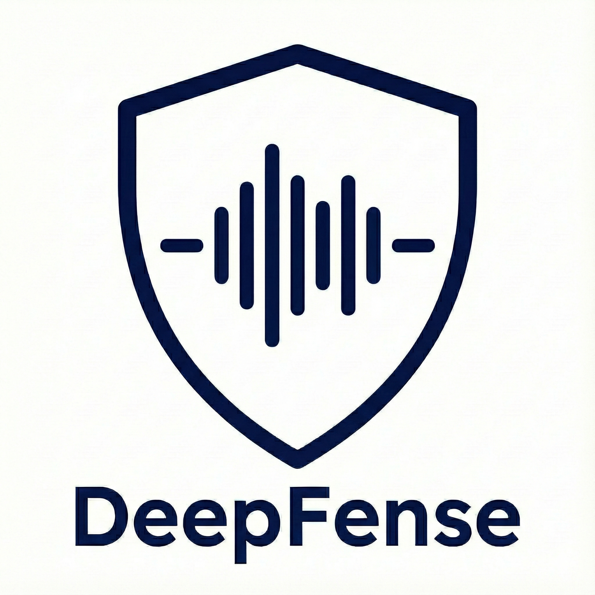

<div align="center">
  
</div>

<div align="center">

# DeepFense

**DeepFense: A Unified, Modular, and Extensible Framework for Robust Deepfake Audio Detection**

[](https://www.python.org/)
[](https://pytorch.org/)
[](LICENSE)

</div>

<div align="center">
  
</div>

> **Partial deepfake / PartialSpoof:** This README and the default `master` branch cover **clip-level** detection. For per-frame labels, `TemporalDetector`, Range EER, PartialSpoof metrics, and related configs, switch to the **`deepfense-partial`** branch:
>
> ```bash
> git fetch origin
> git checkout deepfense-partial
> ```

---

## What is DeepFense?

DeepFense lets you build deepfake audio detectors by combining **frontends** (pretrained feature extractors), **backends** (classifiers), and **loss functions** — all defined in a single YAML config. No code changes needed to run new experiments.

The diagram above shows both **clip-level** and **partial deepfake** pipelines. On `master`, training and docs focus on clip-level detection (one score per utterance). For partial deepfake, use **`git checkout deepfense-partial`** (see note above).

```
Raw Audio --> Frontend (Wav2Vec2, WavLM, HuBERT, ...) --> Backend (AASIST, MLP, ...) --> Loss --> Score
```

---

## Install

```bash
conda create -n deepfense python=3.10
conda activate deepfense
pip install deepfense
```

Or install from source (for development):

```bash
conda create -n deepfense python=3.10
conda activate deepfense
git clone https://github.com/Yaselley/deepfense-framework
cd deepfense-framework
pip install -e .
```

---

## Quick Start

### 1. Generate dummy test data

```bash
python tests/create_samples.py
```

### 2. Train

```bash
python train.py --config deepfense/config/train.yaml
```

### 3. Test

```bash
python test.py \
    --config deepfense/config/train.yaml \
    --checkpoint outputs/Wav2Vec2_Nes2Net_Example_*/best_model.pth
```

### 4. Multi-GPU Training

DeepFense supports multi-GPU training out of the box via PyTorch DDP. Just use `torchrun`:

```bash
# 2 GPUs on a single node
torchrun --nproc_per_node=2 train.py --config deepfense/config/train.yaml

# 4 GPUs
torchrun --nproc_per_node=4 train.py --config deepfense/config/train.yaml
```

No config changes required -- DDP is detected automatically. Checkpoints, logs, and evaluation run on rank 0 only. The saved checkpoints are identical to single-GPU ones and can be loaded without any DDP-specific handling.

### 5. Use real data

Create a Parquet file with columns `ID`, `path`, `label` (`"bonafide"` / `"spoof"`), then update the config:

```yaml
data:
  train:
    parquet_files: ["/path/to/train.parquet"]
  val:
    parquet_files: ["/path/to/val.parquet"]
```

---

## How Configuration Works

Everything is controlled by a single YAML file. Here is the anatomy:

```yaml
# ---------- experiment ----------
exp_name: "my_experiment"
output_dir: "./outputs/"
seed: 42

# ---------- data ----------
data:
  sampling_rate: 16000
  label_map: {"bonafide": 1, "spoof": 0}
  train:
    parquet_files: ["train.parquet"]
    batch_size: 32
    base_transform:
      - type: "pad"
        max_len: 64600          # ~4 sec at 16 kHz
    augment_transform:          # training only
      - type: "rawboost"
        noise_ratio: 0.4
  val:
    parquet_files: ["val.parquet"]
    batch_size: 64
    base_transform:
      - type: "pad"
        max_len: 64600

# ---------- model ----------
model:
  type: "StandardDetector"
  frontend:
    type: "wav2vec2"                    # or wavlm, hubert, mert, eat
    args:
      source: "huggingface"             # or "fairseq" for local .pt files
      ckpt_path: "facebook/wav2vec2-xls-r-300m"
      freeze: True
  backend:
    type: "AASIST"                      # or MLP, Nes2Net, ECAPA_TDNN, RawNet2
    args:
      input_dim: 1024                   # must match frontend output dim
  loss:
    - type: "OCSoftmax"                 # or CrossEntropy, AMSoftmax, ASoftmax
      weight: 1.0
      embedding_dim: 32                 # must match backend output dim

# ---------- training ----------
training:
  epochs: 50
  device: "cuda"
  optimizer:
    type: "adam"
    lr: 0.0001
  scheduler:
    type: "cosine_annealing"
    T_max: 50
  monitor_metric: "EER"
  monitor_mode: "min"
  metrics:
    EER: {}
    ACC: {}
    minDCF: {Pspoof: 0.05}
```

See the [Full Tutorial](docs/03_full_tutorial.md) for a detailed walkthrough of every parameter.

---

## Available Components

| Category | Options |
|----------|---------|
| **Frontends** | Wav2Vec2, WavLM, HuBERT, MERT, EAT |
| **Backends** | AASIST, ECAPA-TDNN, Nes2Net, RawNet2, MLP, TCM |
| **Losses** | CrossEntropy, OC-Softmax, AM-Softmax, A-Softmax |
| **Augmentations** | RawBoost, RIR, Codec, AdditiveNoise, SpeedPerturb, AddBabble, DropChunk, DropFreq |
| **Metrics** | EER, minDCF, actDCF, ACC, F1 |

List them from the CLI:

```bash
deepfense list
deepfense list --component-type backends
```

---

## Pretrained Models & Datasets (HuggingFace Hub)

DeepFense publishes **455+ pretrained models** and **12 datasets** at [huggingface.co/DeepFense](https://huggingface.co/DeepFense).

```bash
# See what's available
deepfense download list-datasets
deepfense download list-models --filter WavLM

# Download a dataset (parquet files)
deepfense download dataset CompSpoof

# Download a pretrained model (checkpoint + config)
deepfense download model ASV19_WavLM_Nes2Net_NoAug_Seed42

# Test the downloaded model
python test.py \
    --config models/ASV19_WavLM_Nes2Net_NoAug_Seed42/config.yaml \
    --checkpoint models/ASV19_WavLM_Nes2Net_NoAug_Seed42/best_model.pth
```

Or in Python:

```python
from deepfense.hub import download_dataset, download_model

parquets = download_dataset("CompSpoof")           # returns list of local paths
files    = download_model("ASV19_WavLM_Nes2Net_NoAug_Seed42")  # returns {"checkpoint": ..., "config": ...}
```

See the [HuggingFace Hub Guide](docs/07_huggingface_hub.md) for full workflows (training, evaluation, inference).

---

## Adding Your Own Component

Every component type follows the same pattern:

1. Create a file (e.g. `deepfense/models/backends/my_backend.py`)
2. Decorate with the registry:
   ```python
   from deepfense.utils.registry import register_backend
   from deepfense.models.base_model import BaseBackend

   @register_backend("MyBackend")
   class MyBackend(BaseBackend):
       def __init__(self, config):
           super().__init__()
           # ...

       def forward(self, x):
           # ...
   ```
3. Import it in the package `__init__.py`
4. Use it in your config:
   ```yaml
   backend:
     type: "MyBackend"
     args: { ... }
   ```

The same pattern applies to frontends, losses, augmentations, datasets, optimizers, and metrics. See the [user guides](docs/user_guide/) for detailed walkthroughs.

---

## Project Structure

```
deepfense/
├── cli/             # CLI commands (train, test, list)
├── config/          # YAML configs + parquet generators
├── data/            # Dataset loading + transforms/augmentations
├── models/
│   ├── frontends/   # Wav2Vec2, WavLM, HuBERT, MERT, EAT
│   ├── backends/    # AASIST, ECAPA-TDNN, Nes2Net, MLP, ...
│   ├── losses/      # OC-Softmax, AM-Softmax, CrossEntropy, ...
│   └── modules/     # Shared layers (pooling, conformer, fairseq_local)
├── training/        # Trainer, evaluator, metrics, seed
└── utils/           # Registry, visualization
```

---

## Documentation

| Guide | Description |
|-------|-------------|
| [Installation](docs/01_installation.md) | Setup instructions |
| [Quick Start](docs/02_quickstart.md) | First model in 5 minutes |
| [Full Tutorial](docs/03_full_tutorial.md) | Every config option explained |
| [Architecture](docs/04_architecture.md) | How DeepFense works internally |
| [Configuration Reference](docs/05_configuration.md) | All YAML parameters |
| [Library Usage](docs/06_library_usage.md) | Use DeepFense as a Python library |
| [HuggingFace Hub](docs/07_huggingface_hub.md) | Download datasets & pretrained models |
| [CLI Reference](docs/cli_reference.md) | CLI commands |
| [Components](docs/components/) | Frontend, backend, loss, augmentation reference |
| [User Guides](docs/user_guide/) | Adding custom components, training workflows |

---

## Citation

```bibtex
@article{kheir2026deepfense,
  title={DeepFense: A Unified, Modular, and Extensible Framework for Robust Deepfake Audio Detection},
  author={Kheir, Yassine El and Das, Arnab and Xiao, Yixuan and Wang, Xin and Kallel, Feidi and Erdogan, Enes Erdem and Vu, Ngoc Thang and Polzehl, Tim and Moeller, Sebastian},
  journal={arXiv preprint arXiv:2604.08450},
  year={2026}
}
```

## License

Apache 2.0 -- see [LICENSE](LICENSE) for details.
