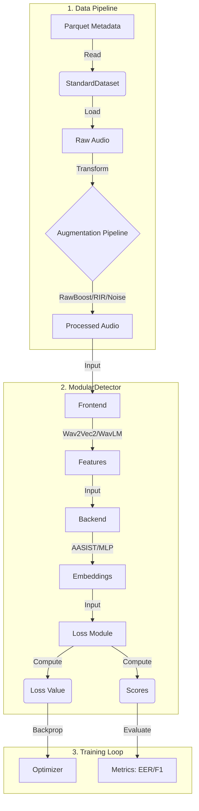

# Architecture Overview

This document explains the modular architecture of DeepFense and how data flows through the system.

---

## System Design

DeepFense is built on a **Registry Pattern**. Every component (Frontend, Backend, Loss, Transform) is registered via decorators and instantiated dynamically from YAML configuration.

### Design Principles

1. **Modularity** — Swap components without changing code
2. **Configuration-Driven** — All experiments defined in YAML
3. **Extensibility** — Add new components with simple decorators
4. **Reproducibility** — Save configs with every experiment

---

## Data Flow



---

## Component Responsibilities

### 1. Data Pipeline (`deepfense/data/`)

| Component | Responsibility |
|-----------|----------------|
| **StandardDataset** | Reads Parquet metadata, maps labels, loads audio |
| **BaseTransform** | Deterministic preprocessing (load, pad, resample) |
| **AugmentationPipeline** | Probabilistic augmentations (RawBoost, RIR, Noise) |
| **CollateFn** | Batching, padding, mask creation |

### 2. ModularDetector (`deepfense/models/detector.py`)

The central `nn.Module` that connects all pieces:

```
ModularDetector
├── frontend: BaseFrontend      # Audio → Features
├── backend: BaseBackend        # Features → Embeddings
└── losses: List[BaseLoss]      # Embeddings → Loss + Scores
```

| Component | Input | Output |
|-----------|-------|--------|
| **Frontend** | `[Batch, Time]` | `[Batch, Time', Dim]` (typically) |
| **Backend** | `[Batch, Time', Dim]` | `[Batch, EmbeddingDim]` |
| **Loss** | `[Batch, EmbeddingDim]` + Labels | Loss scalar + Scores |

### 3. Training Loop (`deepfense/training/`)

| Component | Responsibility |
|-----------|----------------|
| **StandardTrainer** | Training loop, checkpointing, logging |
| **Evaluator** | Compute metrics (EER, F1, Accuracy) |
| **Optimizers** | Adam, AdamW, SGD (from registry) |
| **Schedulers** | CosineAnnealing, StepLR (from registry) |

---

## Registry Pattern

All components are registered using decorators:

```python
from deepfense.utils.registry import register_frontend

@register_frontend("my_frontend")
class MyFrontend(BaseFrontend):
    def __init__(self, config):
        ...
```

This allows YAML-driven instantiation:

```yaml
frontend:
  type: "my_frontend"  # Matches decorator name
  args:
    param1: value1
```

---

## Directory Structure

```
deepfense-framework/
├── deepfense/
│   ├── config/                  # YAML configurations
│   │   ├── train.yaml          # Main training config
│   │   └── experiments/        # Experiment-specific configs
│   │
│   ├── data/                    # Data handling
│   │   ├── base_dataset.py     # Abstract dataset
│   │   ├── detection_dataset.py # StandardDataset
│   │   ├── data_utils.py       # Collate, DataLoader builder
│   │   └── transforms/         # Preprocessing & augmentation
│   │       ├── transforms.py   # load_audio, pad
│   │       ├── augmentations.py # RawBoost, RIR, Noise
│   │       └── RawBoost/       # RawBoost implementation
│   │
│   ├── models/                  # Neural network modules
│   │   ├── detector.py         # ModularDetector
│   │   ├── base_model.py       # Base classes
│   │   │
│   │   ├── frontends/          # Feature extractors
│   │   │   ├── wav2vec2.py
│   │   │   ├── wavlm.py
│   │   │   ├── hubert.py
│   │   │   ├── mert.py
│   │   │   └── eat.py
│   │   │
│   │   ├── backends/           # Classifiers
│   │   │   ├── aasist.py
│   │   │   ├── ecapa_tdnn.py
│   │   │   ├── rawnet.py
│   │   │   ├── mlp.py
│   │   │   └── nes2net.py
│   │   │
│   │   ├── losses/             # Loss functions
│   │   │   ├── oc_softmax.py
│   │   │   ├── am_softmax.py
│   │   │   ├── a_softmax.py
│   │   │   └── cross_entropy.py
│   │   │
│   │   └── modules/            # Shared modules
│   │       ├── pool.py         # Pooling layers
│   │       └── wavlm/          # WavLM implementation
│   │
│   ├── training/                # Training infrastructure
│   │   ├── base_trainer.py     # Abstract trainer
│   │   ├── standard_trainer.py # Main trainer
│   │   ├── set_seed.py         # Reproducibility
│   │   └── evaluations/        # Metrics
│   │       ├── evaluator.py
│   │       └── metrics.py
│   │
│   └── utils/                   # Utilities
│       ├── registry.py         # Component registry
│       └── visualization.py    # Plotting
│
├── docs/                        # Documentation
├── outputs/                     # Training outputs
├── train.py                     # Training entry point
└── test.py                      # Testing entry point
```

---

## Forward Pass Details

```python
# Simplified forward pass
def forward(self, x, mask=None):
    # 1. Frontend: Extract features
    features = self.frontend(x, mask=mask)  # [B, T] → [B, T', D]
    
    # 2. Backend: Compute embeddings
    embeddings = self.backend(features)      # [B, T', D] → [B, E]
    
    # 3. Loss module: Get scores
    scores = self.losses[0].get_score(embeddings)  # [B, E] → [B]
    
    return {"embeddings": embeddings, "scores": scores}
```

---

## Loss Computation

```python
def compute_loss(self, outputs, targets):
    embeddings = outputs["embeddings"]
    total_loss = 0.0
    
    for loss_module, weight in zip(self.losses, self.loss_weights):
        loss_val = loss_module(embeddings, targets)
        total_loss += weight * loss_val
    
    return total_loss
```

---

> **Next Step**: [Configuration Reference →](05_configuration.md)
